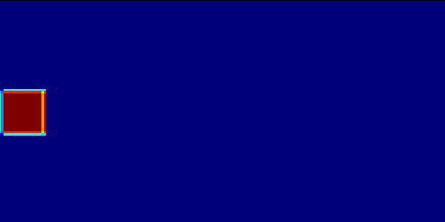

# LB-RelativisticFluid-CUDA
CUDA implementation for the Lattice Boltzmann simulation scheme for relativistic fluids reported in [arXiv:1009.0129](https://arxiv.org/abs/1009.0129) by M. Mendoza, B. M. Boghosian, H. J. Herrmann, S. Succi.

 

